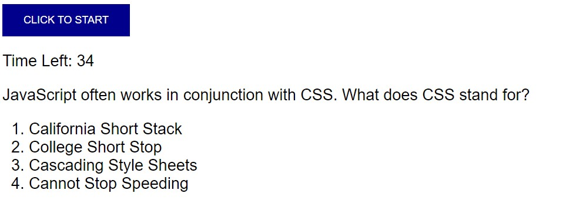

# homework-4

## 04: Code Quiz

This project is built to provide coding boot camp students with a timed quiz on JavaScript fundamentals. The quiz stores the high scores so that a student can gauge their progress on fundamental concepts.

## Mock-up

## Installation

The code quiz is here: https://matthewestes33.github.io/homework-4/

All elements of the project can be examined here: https://github.com/matthewestes33/homework-4

## Credits

Referenced tutorials from MDN Web Pages and W3Schools:

CSS Buttons: https://www.w3schools.com/css/css3_buttons.asp

JS Document.querySelector(): https://developer.mozilla.org/en-US/docs/Web/API/Document/querySelector

JS Increment: https://developer.mozilla.org/en-US/docs/Web/JavaScript/Reference/Operators/Increment

JS Decrement: https://developer.mozilla.org/en-US/docs/Web/JavaScript/Reference/Operators/Decrement

## Features

The user is provided with an initial start button to begin quiz.

Upon starting quiz, the user is presented with the first question in a timed game.

After answering a question, the user is presented with another question, until the last question in the quiz is completed.

To enhance gameplay, incorrect answers incur a time penalty.

When all questions are answered, or when time expires, the game concludes. 

When the game concludes, the user is prompted to save their initials.

The user's initials and the user's score (corresponding to the number of seconds remaining on the clock at the conclusion of the game) are saved in the user browser's local storage.

Upon saving their initials, the user's score is displayed next to their initials.
